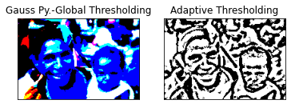

# Thresholding_layers_of_image_pyramids

Constructing Gaussian pyramid and Laplacian pyramid of an image and applying global and adaptive thresholding techniques to perform segmentation at different levels of both image
pyramids. The comparitive the results of image layer segmentation for both the image pyramids is as follows.

 
<h2>INPUT IMAGE</h2>

 

<h2>OUTPUT IMAGES</h2>

<h4>for</h4>

<h3>SEGMENTATION OF DIFFERENT LAYERS OF GAUSSIAN PYRAMID USING GLOBAL AND ADAPTIVE THRESHOLDING</h3>

 

<h3>SEGMENTATION OF DIFFERENT LAYERS OF LAPLACIAN PYRAMID USING GLOBAL AND ADAPTIVE THRESHOLDING</h3>

